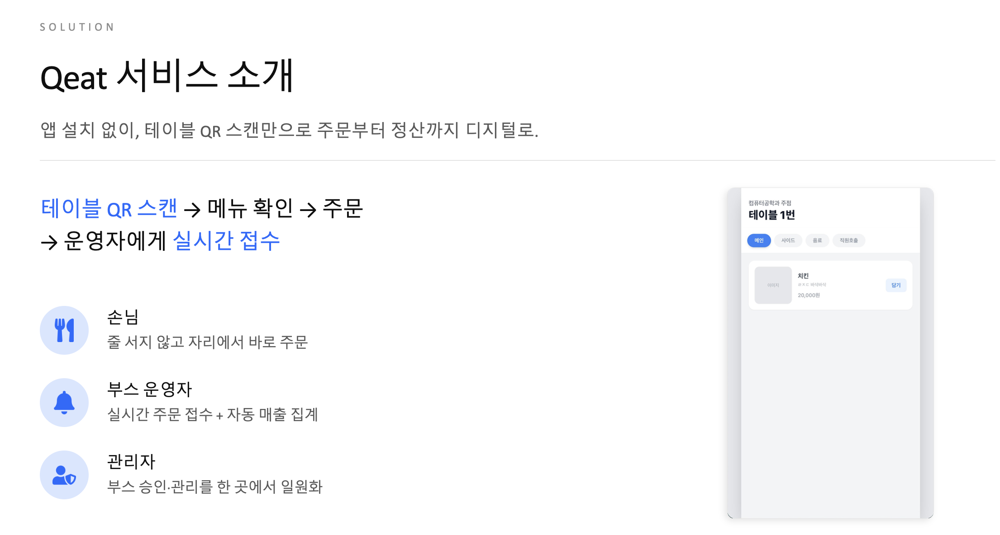
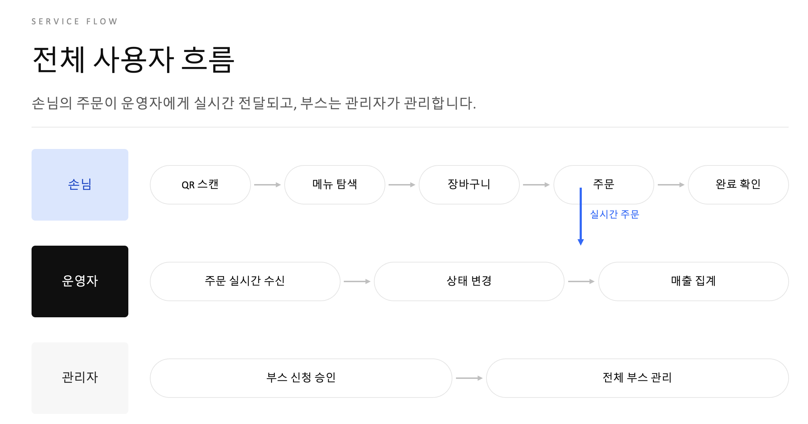
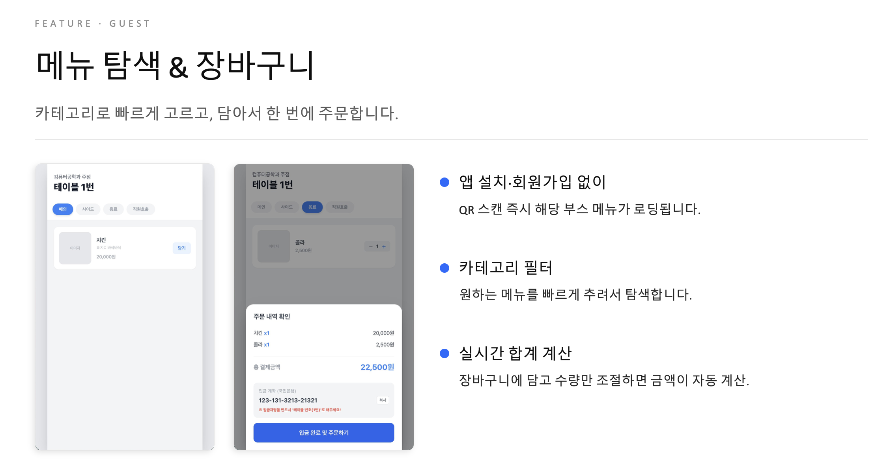
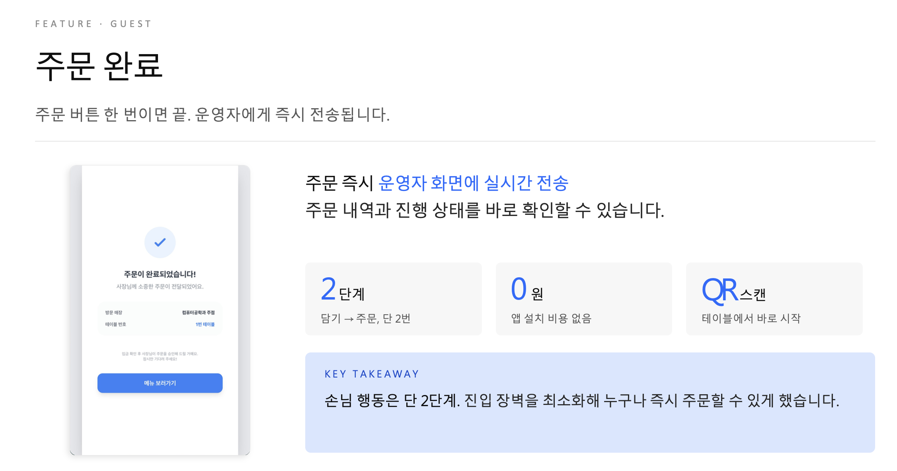
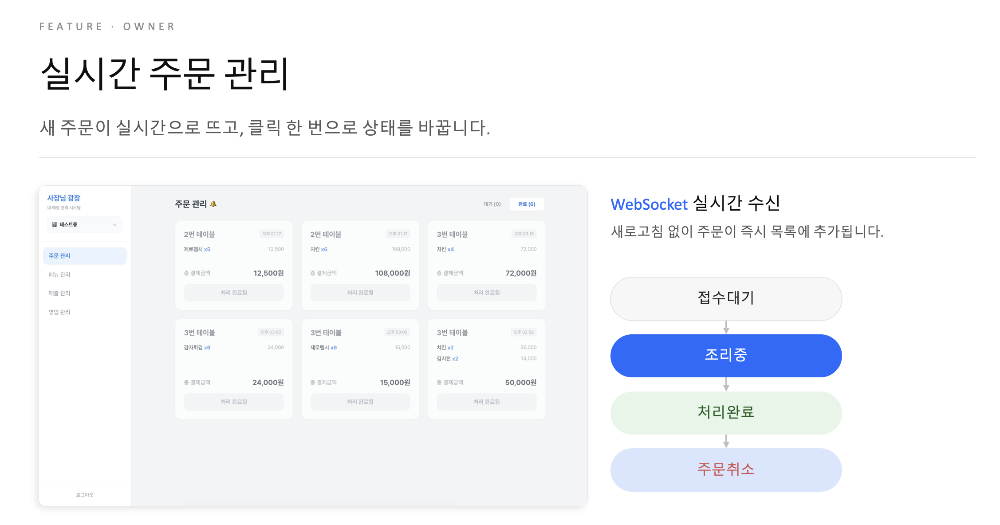
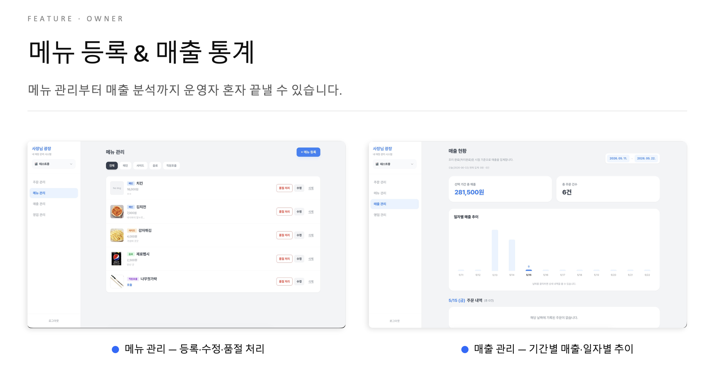
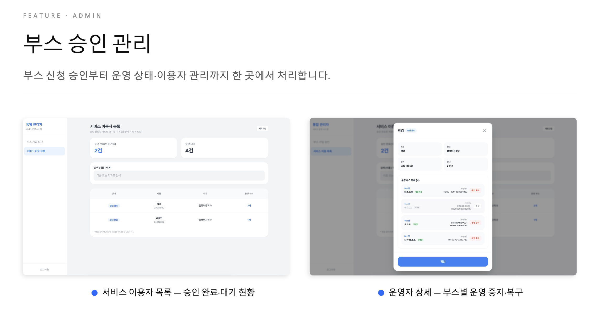

# Qeat Backend

세종대학교 축제 부스 운영을 위한 QR 주문 관리 시스템의 백엔드입니다.  
사용자는 테이블 QR을 통해 메뉴를 조회하고 주문할 수 있고, 운영자는 부스, 메뉴, 테이블, 주문, 매출을 관리할 수 있습니다.

## Overview

Qeat은 대학 축제처럼 짧은 시간 안에 주문이 몰리는 환경에서,  
복잡한 앱 설치 없이 QR 스캔만으로 빠르게 주문을 처리할 수 있도록 설계한 서비스입니다.

- 손님: QR 접속 후 비로그인 주문
- 운영자: 부스/메뉴/주문/매출 관리
- 관리자: 부스 승인 및 운영자 관리



## My Role

이 프로젝트에서 저는 **Spring Boot 기반 백엔드 개발**을 담당했습니다.

- 부스, 메뉴, 테이블, 주문, 매출 도메인 설계
- REST API 구현
- Spring Security 기반 권한 처리
- 세션 기반 인증 처리 (Redis 세션 저장)
- MySQL 연동 및 JPA 기반 데이터 관리
- QR 주문 흐름 및 테이블 토큰 처리
- Redis를 활용한 공개 메뉴 캐시와 공개 주문 제한

프론트엔드는 팀원이 **React**로 담당했습니다.

## Tech Stack

- Backend: Java 21, Spring Boot, Spring Web, Spring Data JPA, Spring Security, Spring Session
- Database / Cache: MySQL 8.4, Redis 7.4, Docker Compose
- Template / Utility: Thymeleaf, Jsoup, ZXing
- Build: Gradle

## Service Flow

손님은 QR 스캔 후 바로 주문하고, 운영자는 주문 목록을 조회해 상태를 변경합니다.  
관리자는 전체 부스와 운영자 상태를 한 곳에서 관리합니다.



## Main Features

### 1. 인증 및 사용자 처리
- 세종대학교 로그인 정보 기반 인증
- JSESSIONID 세션 쿠키 기반 인증 유지
- 세션은 Redis에 저장해 서버가 늘어나도 로그인이 유지됨
- 운영자 / 관리자 권한 분리

### 2. 부스 관리
- 부스 생성, 조회, 수정
- 부스 승인 / 거절 / 중지 / 삭제
- 영업 상태 및 영업 시간 관리

### 3. 메뉴 관리
- 메뉴 등록, 조회, 수정, 삭제
- 이미지 업로드
- 품절 상태 관리
- 메뉴 등록/수정/삭제/품절 시 공개 메뉴 Redis 캐시 무효화

### 4. 테이블 및 QR 주문
- 부스별 테이블 생성 및 일괄 생성
- 테이블별 QR 토큰 발급
- QR 접근 시 메뉴 조회 및 주문 가능
- 공개 메뉴 조회(`GET /api/public/tables/{token}`)는 Redis에 5분 캐시
- `canOrder`는 캐시하지 않고 요청마다 계산



### 5. 주문 관리
- 주문 생성
- 주문 상태 변경
  - 입금 확인
  - 조리 중
  - 완료
  - 취소
- 공개 주문은 같은 테이블+IP 기준 1분에 20회까지 허용, 초과 시 429
- 주문 원본은 MySQL에 저장



### 6. 운영자 주문 처리
- 주문 목록 조회로 새 주문 확인
- 클릭 한 번으로 주문 상태 변경
- 접수 대기 / 조리 중 / 처리 완료 흐름 관리



### 7. 메뉴 및 매출 관리
- 메뉴 등록 / 수정 / 삭제 / 품절 처리
- 기간별 총 매출 조회
- 일자별 주문 수 / 매출 집계



### 8. 관리자 승인 및 운영 관리
- 부스 신청 승인 / 대기 현황 관리
- 운영자별 부스 목록 조회
- 부스별 운영 중지 / 복구 관리



## Project Structure

```text
com.qeat
├── controller
├── service
├── repository
├── domain
├── dto
├── exception
└── global
    ├── redis
    └── security
```

## Running Locally

### 1. 환경 변수 준비

프로젝트 루트에 `.env` 파일을 준비합니다.  
기본 형식은 `.env.example`을 참고하면 됩니다.

예시:

```properties
MYSQL_DATABASE=qeat
MYSQL_USER=qeat_user
MYSQL_PASSWORD=change-me
MYSQL_ROOT_PASSWORD=change-me
TZ=Asia/Seoul

DB_URL=jdbc:mysql://localhost:1000/qeat?useSSL=false&allowPublicKeyRetrieval=true&serverTimezone=Asia/Seoul&useUnicode=true&characterEncoding=utf8&connectionCollation=utf8mb4_unicode_ci
DB_USERNAME=qeat_user
DB_PASSWORD=change-me

FILE_DIR=./uploads
FILE_URL_PREFIX=/uploads
QR_BASE_URL=http://localhost:5173
SERVER_PORT=9090
REDIS_HOST=localhost
REDIS_PORT=6379
```

### 2. MySQL과 Redis 실행

```bash
docker compose up -d
```

Docker Compose 기준 포트는 다음과 같습니다.

```text
MySQL  localhost:1000 -> container 3306
Redis  localhost:6379 -> container 6379
```

### 3. 백엔드 실행

```bash
./gradlew bootRun
```

기본 실행 주소:

```text
http://localhost:9090
```

## API Examples

### 인증
- `POST /api/auth/login`
- `GET /api/auth/me`
- `POST /api/auth/logout`

### 부스
- `POST /api/booths`
- `GET /api/booths/my`

### 메뉴
- `POST /api/booths/{boothId}/menus`
- `GET /api/booths/{boothId}/menus`

### 테이블
- `POST /api/booths/{boothId}/tables`
- `POST /api/booths/{boothId}/tables/bulk`

### 공개 QR
- `GET /api/public/tables/{tableToken}`
- `POST /api/public/tables/{tableToken}/orders`

### 주문
- `POST /api/booths/{boothId}/orders`
- `GET /api/booths/{boothId}/orders`
- `PATCH /api/orders/{orderId}/booths/{boothId}/confirm`
- `PATCH /api/orders/{orderId}/booths/{boothId}/complete`
- `PATCH /api/orders/{orderId}/booths/{boothId}/cancel`

### 매출
- `GET /api/booths/{boothId}/sales-summary`

## Frontend Integration

프론트엔드는 React로 구현되었고, 인증은 세션 쿠키 기반으로 처리됩니다.  
따라서 인증이 필요한 요청은 반드시 쿠키를 포함해야 합니다.

```js
fetch("http://localhost:9090/api/auth/me", {
  credentials: "include",
});
```

또는 Axios 사용 시:

```js
axios.get("http://localhost:9090/api/auth/me", {
  withCredentials: true,
});
```

## Notes

- 이 레포는 **백엔드 프로젝트**입니다.
- 프론트엔드는 별도 React 프로젝트에서 개발되었습니다.
- 현재 배포는 하지 않았고, 로컬 및 Docker 기반 개발 환경을 기준으로 구성했습니다.
- 로컬 실행 시 MySQL과 Redis를 함께 띄워야 합니다. Redis는 공개 메뉴 캐시, 세션 저장, 공개 주문 제한에 사용합니다.

## Next Improvements

- 테스트용 DB 분리
- Swagger 또는 API 문서화 추가
- 아키텍처 다이어그램 및 ERD 정리
- 예외 처리 / 보안 정책 문서화
